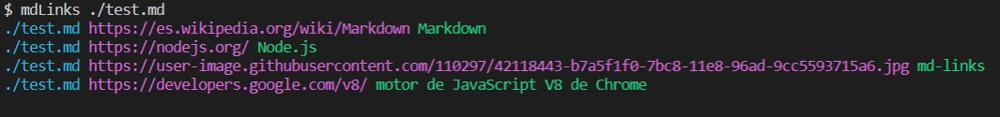
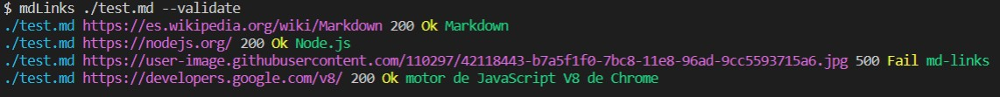

# Markdown Links (Leidy Daniela Toro)

## Índice

* [1. Preámbulo](#1-preámbulo)
* [2. Resumen del proyecto](#2-resumen-del-proyecto)
* [3. Guía de instalación](#3-guía-de-instalación)
* [4. Manual de uso](#4-manual-de-uso)
* [4. Test](#4-test)

***

## 1. Preámbulo

[Markdown](https://es.wikipedia.org/wiki/Markdown) es un lenguaje de marcado
ligero muy popular entre developers. Es usado en muchísimas plataformas que
manejan texto plano (GitHub, foros, blogs, ...), y es muy común
encontrar varios archivos en ese formato en cualquier tipo de repositorio
(empezando por el tradicional `README.md`).

Estos archivos `Markdown` normalmente contienen _links_ (vínculos/ligas) que
muchas veces están rotos o ya no son válidos y eso perjudica mucho el valor de
la información que se quiere compartir.

Dentro de una comunidad de código abierto, nos han propuesto crear una
herramienta usando [Node.js](https://nodejs.org/), que lea y analice archivos
en formato `Markdown`, para verificar los links que contengan y reportar
algunas estadísticas.

## 2. Resumen del proyecto

Este proyecto es una biblioteca de funciones creada con Javascript y Node.js, que permite validar:

* Si un archivo es markdown.
* Si contiene enlaces. 
* En caso de que el archivo contenga enlaces, la biblioteca permite validar el estado de los mismos, además identifica cuantos hay, cuantos son únicos y cuantos están rotos.

## 3. Guía de instalación

Para instalar, escriba en la terminal el comando `npm i daniela-toro-md-links -g`. Este módulo puede ser ejecutado directamente en la terminal. 

## 4. Manual de uso

Para ejecutar el módulo mdLinks, ingrese la información de la siguiente manera:

`mdLinks <path-to-file> [options]`

* `<path-to-file>`: La ruta puede ser absoluta o relativa al directorio. 

* `[options]`: Puede ingresar `--validate`, `--validate --stats` o `--stats`.

* Si usted no ingresa ninguna opción, la función mdLinks leerá el archivo ingresado, validará la existencia de enlaces y en caso de hallarlos, devolvera la información del archivo de la siguiente manera:

![anyOptions]

* `--validate`: Si usted ingresa `--validate`, se realizará una petición HTTP para validar el estado de los enlaces y se mostrará así:

* `--stats`: Si usted ingresa `--stats`, la salida será un texto con estadísticas básicas de los enlaces. 

* `--validate --stats`: Si usted ingresa `--validate --stats`, la salida será un texto con estadísticas básicas de los enlaces, que incluirá la cantidad de enlaces rotos. 

## 5. Test

`npm test`